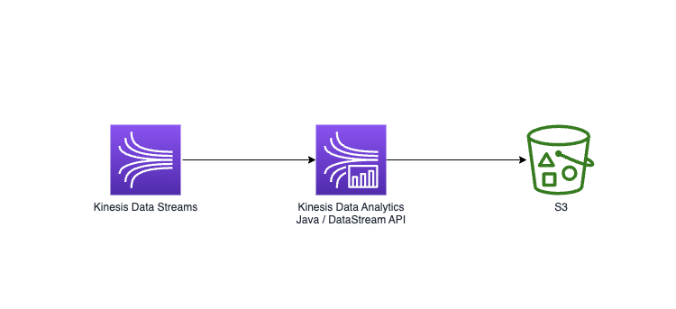

# KDS to S3 (Java Datastream API)

This blueprint deploys a KDA app that reads from Kinesis Data Streams (KDS) using IAM auth and writes to S3 using the Java DataStream API:



## Project details

1. Flink version: `1.15.2`
2. Java version: `11`

## Key components used

1. New (in Flink 1.13) `KafkaSource` connector (`FlinkKafkaSource` is slated to be deprecated).
2. `FileSink` (`StreamingFileSink` is slated to be deprecated).

## High-level deployment steps

1. Build app and copy resulting JAR to S3 location
2. Deploy associated infra (KDS and KDA) using CDK script
    - If using existing resources, you can simply update app properties in KDA.
3. Perform data generation

## Prerequisites

1. Maven
2. AWS SDK v2
2. AWS CDK v2 - for deploying associated infra (KDS Stream and KDA app)

## Step-by-step deployment walkthrough

NOTE: If you're redeploying app, see Redeployment section below.

1. First, let's set up some environment variables to make the deployment easier. Replace these values with your own S3 bucket, app name, etc.

```bash
export AWS_PROFILE=<<profile-name>>
export APP_NAME=<<name-of-your-app>>
export S3_BUCKET=<<your-s3-bucket-name>>
export S3_FILE_KEY=<<your-jar-name-on-s3>>
```

2. Build Java Flink application locally.

From root directory of this project, run:

```
mvn clean package
```

3. Copy jar to S3 so it can be referenced in CDK deployment

```bash
aws s3 cp target/<<your generated jar>> ${S3_BUCKET}/{S3_FILE_KEY}
```

4. Follow instructions in the [`cdk-infra`](cdk-infra/README.md) folder to deploy the infrastructure associated with this app - such as the source KDS stream and the Kinesis Data Analytics application.

5. Follow instructions in [orders-datagen](../../../datagen/orders-datagen/README.md) to create topic and generate data into the source KDS stream.

6. Start your Kinesis Data Analytics application from the AWS console.

7. Do a Flink query or S3 Select Query against S3 to view data written to S3.