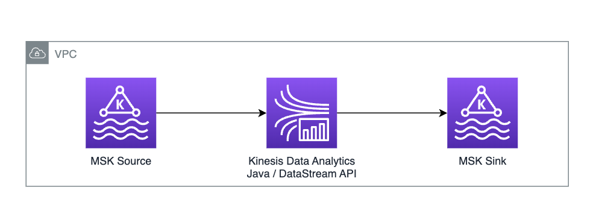

# MSK Serverless to MSK Serverless (Java Datastream API)

This blueprint deploys a KDA app that reads from MSK Serverless using IAM auth and writes to MSK Serverless using the Java DataStream API.



## Project details

1. Flink version: `1.15.2`
2. Java version: `11`
3. Scala version: `2.12`

## Key components used

1. `KafkaSource` connector (`FlinkKafkaSource` is slated to be deprecated).
2. `KafkaSink` connector

## High-level deployment steps

1. Build app and copy resulting JAR to S3 location
2. Deploy associated infra (MSK and KDA) using CDK script
   - If using existing resources, you can simply update app properties in KDA.
3. Perform data generation

## Prerequisites

1. Maven
2. AWS SDK v2
3. AWS CDK v2 - for deploying associated infra (MSK and KDA app)

## Step-by-step deployment walkthrough

1. First, let's set up some environment variables to make the deployment easier. Replace these values with your own S3 bucket, app name, etc.

```bash
export AWS_PROFILE=<<profile-name>>
export APP_NAME=<<name-of-your-app>>
export S3_BUCKET=<<your-s3-bucket-name>>
export S3_FILE_KEY=<<your-jar-name-on-s3>>
```

2. Build Java Flink application locally.

From root directory of this project, run:

```
mvn clean compile package
```

3. Copy jar to S3 so it can be referenced in CDK deployment

```bash
aws s3 cp target/<<your generated jar>> ${S3_BUCKET}/{S3_FILE_KEY}
```

4. Follow instructions in the [`cdk`](cdk-infra/README.md) page to *deploy* the infrastructure associated with this app - such as MSK Serverless and the Kinesis Data Analytics application.

5. Follow instructions in [orders-datagen](../../../datagen/orders-datagen/README.md) to generate data into MSK.

6. Start your Kinesis Data Analytics application from the AWS console.

7. Do a Flink query against the Destination Kafka Topic to validate data has landed in the destination topic.
