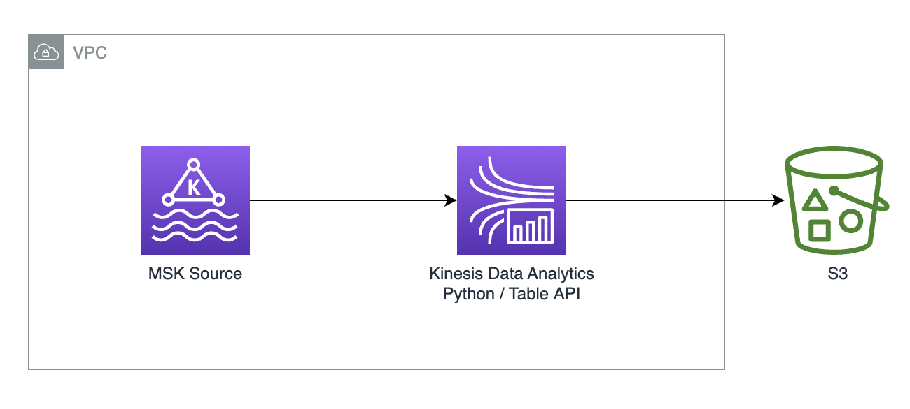

# MSK Serverless to S3 (Python Table API)

This blueprint deploys a KDA app that reads from MSK Serverless using IAM auth and writes to S3 using the Python Table API:



## Project details

1. Flink version: `1.15.2`
2. Python version: `3.8`

## Key components used

1. New (in Flink 1.13) `KafkaSource` connector (`FlinkKafkaSource` is slated to be deprecated).
2. `FileSink` (`StreamingFileSink` is slated to be deprecated).

## High-level deployment steps

1. Package and deploy Python to S3
2. Deploy associated infra (MSK and KDA) using CDK script
    - If using existing resources, you can simply update app properties in KDA.
3. Perform data generation

## Prerequisites

1. Maven
2. AWS SDK v2
2. AWS CDK v2 - for deploying associated infra (MSK and KDA app)

## Step-by-step deployment walkthrough

1. First, let's set up some environment variables to make the deployment easier. Replace these values with your own S3 bucket, app name, etc.

```bash
export AWS_PROFILE=<<profile-name>>
export APP_NAME=<<name-of-your-app>>
export S3_BUCKET=<<your-s3-bucket-name>>
export S3_FILE_KEY=<<your-jar-name-on-s3>>
```

2. Package Python app folder into zip package

Please follow the instructions detailed [here](https://github.com/aws-samples/amazon-kinesis-data-analytics-examples/tree/master/python/PythonPackages).

3. Copy zip package to S3 so it can be referenced in CDK deployment

```bash
aws s3 cp target/<<your app zip>> ${S3_BUCKET}/{S3_FILE_KEY}
```

4. Follow instructions in the [`cdk-infra`](cdk-infra/README.md) folder to *deploy* the infrastructure associated with this app - such as MSK Serverless and the Kinesis Data Analytics application.

5. Follow instructions in [orders-datagen](../../../datagen/orders-datagen/README.md) to create topic and generate data into MSK.

6. Start your Kinesis Data Analytics application from the AWS console.

7. Do a Flink query or S3 Select Query against S3 to view data written to S3.